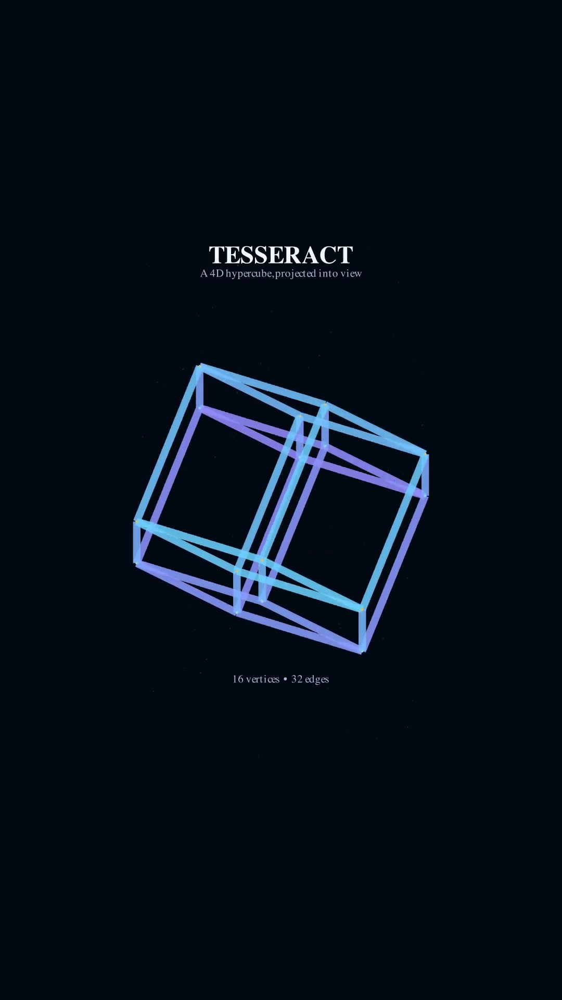
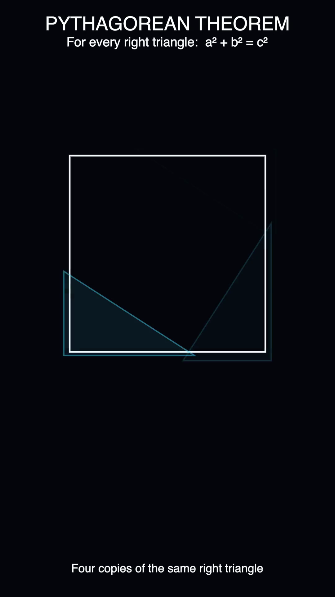
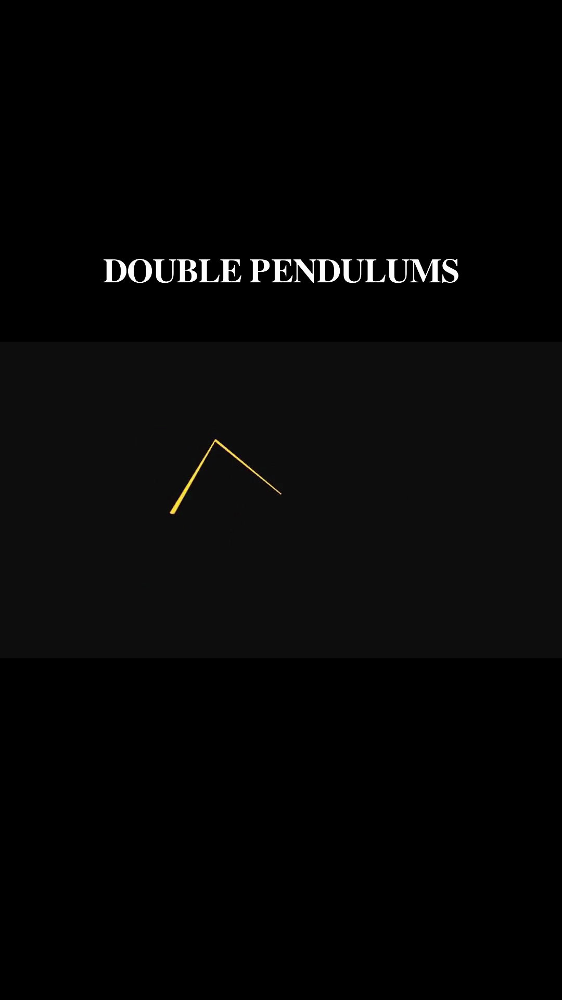
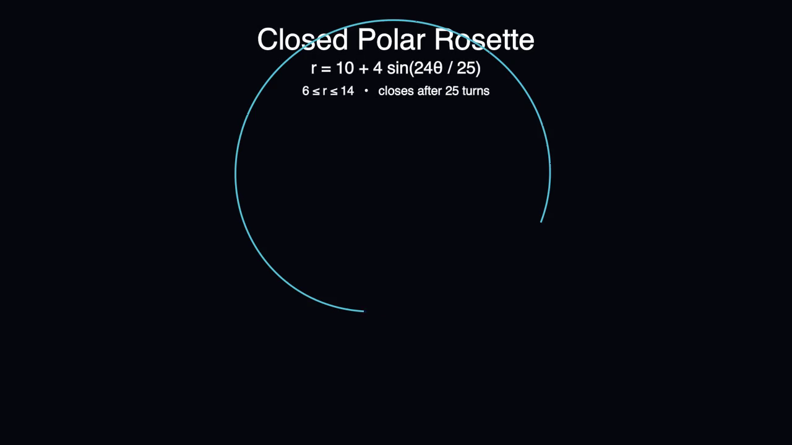
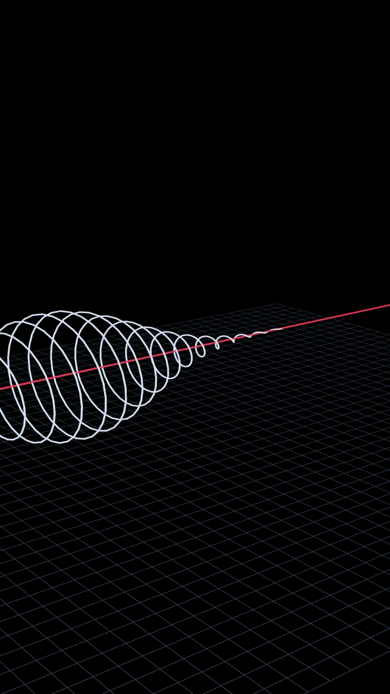

# proof-motion

A home for the source files behind Proof Motion's YouTube animations and simulations.

Each upload lives in its own project folder, while reusable scenes, assets, and configuration live in `shared/`.

## Project gallery

| Project | Preview |
| --- | --- |
| Rotating Tesseract 4D | [](projects/shorts/rotating-tesseract-4d/) |
| Pythagorean Proof | [](projects/shorts/pythagorean-proof/) |
| Chaotic Pendulums | [](projects/shorts/chaotic-pendulums/) |
| Polar Rosette | [](projects/shorts/polar-rosette/) |
| Periwinkle Core Helix | [](projects/shorts/periwinkle-core-helix/) |

## Repository layout

```text
projects/
  shorts/       # Vertical, short-form videos
  videos/       # Long-form YouTube videos
shared/
  assets/       # Reusable images, audio, fonts, and 3D models
  blender/      # Reusable Blender materials, rigs, and helpers
  manim/        # Reusable Manim scenes and utilities
templates/      # Starting point for a new project
docs/           # Workflow notes and publishing records
```

## Start a new animation

Copy `templates/project/` into either `projects/shorts/` or `projects/videos/`, then rename it with a descriptive, kebab-case slug:

```bash
cp -R templates/project projects/shorts/my-animation-slug
```

Fill in `README.md` with the idea, status, and render command. Keep source code and project-only assets inside that project directory. A derived still for GitHub presentation belongs in `preview/thumbnail.png`, not `assets/`.

## What belongs in Git

Commit source code, Blender files, scripts, small source assets, documentation, and render settings. Generated videos, Manim render caches, preview files, and Python caches are ignored by default. Use Git LFS for large source assets that must be versioned.
